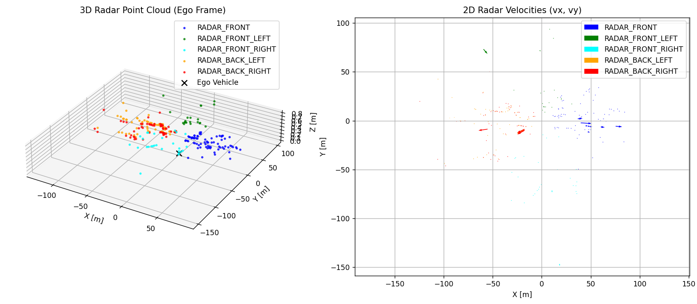
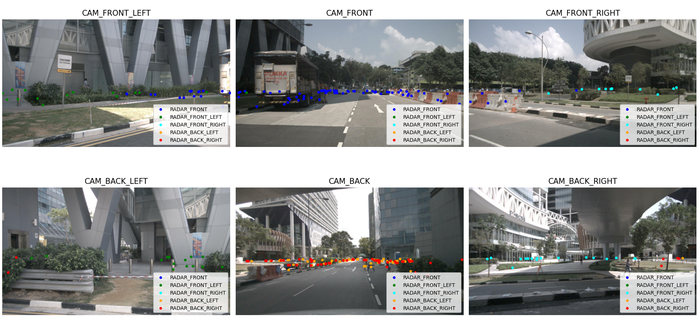

# NuScenes Radar Visualization

This project visualizes radar point clouds from the [nuScenes](https://www.nuscenes.org/) dataset by rendering them in the ego vehicle frame and overlaying them onto the six RGB camera images, with distinct colors used to distinguish between the five radar sensors.

## Features

- Multi-sensor fusion: Transforms radar detections from all five radar sensors into a shared ego vehicle coordinate frame.

- 3D visualization: Displays radar points as a 3D point cloud, color-coded by sensor.

- 2D velocity visualization: Shows radar velocity vectors (vx, vy) in the ego vehicle's plane.

- Camera overlays: Projects radar points onto all six RGB camera images using camera calibration data, with per-sensor color coding.

## Setup

1. **Install Dependencies**

```bash
pip install nuscenes-devkit matplotlib numpy pyquaternion
````

2. **Download nuScenes dataset (full or mini version)**

Register and download the dataset from the [nuScenes website](https://www.nuscenes.org/download).

Extract it somewhere, e.g., `.../nuscenes-mini`

## Usage

Run the script directly:

```bash
python visualize_radar.py --data_path "D:/path/to/nuscenes-dataset" --version "v1.0-mini"
```


* `--data_path` is the folder where your `samples/`, `sweeps/`, `maps/` folders are located.
* `--version` is the version of dataset. The default is `"v1.0-mini"`

## Output

The script generates two visualizations:

### Figure 1: Radar in Ego Frame

* 3D scatter plot of radar detections
* 2D quiver plot of radial velocities

### Figure 2: Radar Projections on Cameras

* Six subplots: one per camera (front, sides, back)
* Radar points color-coded by sensor

## Example


<p align="center">
  <br/>
  <b>Radar in Ego Frame</b>
</p>

<p align="center">
  <br/>
  <b>Radar Projections on Cameras</b>
</p>
